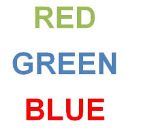

```{r setup, include=FALSE}
knitr::opts_chunk$set(echo = TRUE, warning = FALSE, message, FALSE)
```

In a Stroop task, participants are presented with a list of words, with each word displayed in a color of ink. The participant's task is to say out loud the color of the ink in which the word is printed. The task has two conditions: a congruent words condition, and an incongruent words condition. In the congruent words condition, the words being displayed are color words whose names match the colors in which they are printed: for example <span style="color:red">RED</span>, <span style="color:blue">BLUE</span>. In the incongruent words condition, the words displayed are color words whose names do not match the colors in which they are printed: for example <span style="color:red">PURPLE</span>, <span style="color:blue">ORANGE</span>. In each case, we measure the time it takes to name the ink colors in equally-sized lists. Each participant will go through and record a time from each condition.



```{r echo = FALSE, warning = FALSE, message = FALSE}
library(dplyr)
library(tidyr)
library(ggplot2)
stroop_data <- read.csv('stroopdata.csv')
```

### Experimental Design

This is a classic example of a repeated measures experimental design, in which the same individuals receive all the treatments and the same dependent variable is measured multiple times (in this case, twice). In this stroop task, the dependent variable is the average response time, one being measured for the congruent words and one being measured for the incongruent words. The independent variable is type of words (congruent vs. incongruent); however, since all participants are being measured for both types of words, recording the independent variable is actually unnecessary.

### Research Question/Hypothesis

In this task, we are interested in whether it takes the same amount of time to correctly respond to both word conditions. If it is the case, the mean difference in response times between the two conditions across all participants should be zero.

Phrasing it formally:

The <strong>null hypothesis</strong> is that <i>the mean within-subject difference in response times between the two conditions equals 0</i>.

The <strong>alternative hypothesis</strong> is that <i>that the mean within-subject difference in response times between the two conditions is not 0</i>.

### Data

The data provided only includes the average response times for both conditions from 24 participants.

```{r echo = FALSE}
stroop_data %>%
  mutate(participant = seq(1, nrow(stroop_data))) %>% 
  gather(key = 'Condition', value = 'time', 1:2) %>%
  ggplot(aes(x = reorder(participant, time), y = time)) +
  geom_point(aes(color = Condition, shape = Condition)) +
  labs(y = 'Response Time (seconds)',
       x = 'Participant ID',
       title = 'Response Times of Participants') +
  theme(panel.grid.major = element_blank(),
        panel.grid.minor = element_blank(),
        panel.background = element_blank(),
        axis.line = element_line(colour = "black"))
```

Clearly, the average response times for incongruent words condition were longer than those for congruent words. On average, the response time for congruent words was 14.05 seconds (sd = 3.56 seconds), and the response time for incongruent words was 22.02 seconds (sd = 4.80 seconds). The observed average difference in response time within each participant was 7.96 seconds (sd = 4.86 seconds).

### Was the observed difference statistically significant?

To determine whether the observed difference was statistically significant (an event that is unlikely to happen due to chance under the assumption that there really is no difference), statistical tests were required. There are many tests available to answer the research question.

Let's be lazy and assume that the within-subject difference in response times between the two conditions is normally distributed (something ought to be checked but skipped entirely for now). Also let's assume the experiment was conducted in a way that all participants were independent of each other. In this case, we simply perform a paired-sample t-test:

```{r}
t.test(stroop_data$Incongruent, stroop_data$Congruent, paired=TRUE)
```

The result shows that the observed average difference of 7.96 seconds was statistically significant, t(23) = 8.021, p = <.001. In other words, if under the assumption of no difference in response times, the probability of observing the difference of 7.96 seconds is less than 0.001, which is probabilistically a highly unlikely event. Thus, we reject the null hypothesis, and the evidence suggests that there is a difference, in this case, on average it takes people 7.96 seconds more to respond to incongruent words.

Now, let's check the normality assumption.

```{r echo = FALSE}
ggplot(mapping = aes(x = stroop_data$Incongruent - stroop_data$Congruent)) +
  geom_histogram(bins = 7) +
  labs(title = 'Distribution of Differences in Response Time',
       x = 'Difference in Response Time (sec)',
       y = 'Count') +
  theme(panel.grid.major = element_blank(),
        panel.grid.minor = element_blank(),
        panel.background = element_blank(),
        axis.line = element_line(colour = "black")) +
  scale_y_continuous(expand = c(0, 0))
```

It can hardly be said to be normally distributed. In this case, we can use the nonparametric Wilcoxon signed-rank test:

```{r}
wilcox.test(stroop_data$Incongruent, stroop_data$Congruent, paired = TRUE)
```

Again, the p-value suggests we should reject the null hypothesis.

### Additional Resources

A variant of the stroop effect was actually designed and implemented by me as an interactive classroom exercise in a graduate level statistics course in [EPSE](http://learningtools.merm.ecps.educ.ubc.ca/basic-statistics/experiments/). Instead of saying out loud the color words, participants needed to respond by typing the correct keys that correspond to the correct colors. The participant's results were shown at the end, and all results from the participants (de-identified) were stored and could be downloaded for further analysis if they wished to. 